# Examen Transversal DIY7111 - Tecnologias de Virtualizacion

**Autor:** Arnaldo Munoz (AMG)
**Asignatura:** DIY7111 - Tecnologias de Virtualizacion (DuocUC)
**Caso:** Despliegue de una aplicacion web sobre contenedores Docker en AWS, orquestada con Docker Compose y aprovisionada con Terraform (Infraestructura como Codigo).

La empresa VZeta necesita desplegar una aplicacion web en contenedores sobre una instancia de nube publica. La infraestructura no admite orquestacion avanzada (Kubernetes, EKS, AKS, GKE), por lo que la orquestacion se resuelve en el propio host mediante Docker Compose. El stack esta formado por un reverse proxy NGINX, una aplicacion Flask de imagen propia y una base de datos PostgreSQL con volumen para la persistencia.

## 1. Justificacion tecnica

### 1.1 Hipervisores frente a contenedores: instalacion y licenciamiento

La virtualizacion tradicional se apoya en un hipervisor que emula hardware completo para ejecutar maquinas virtuales, cada una con su propio sistema operativo invitado. En productos como VMware ESXi o Microsoft Hyper-V, la instalacion implica provisionar un sistema operativo entero por cada maquina, lo que consume varios gigabytes de memoria y disco y arranca en minutos. En materia de licenciamiento, estas plataformas son en su mayoria comerciales: VMware vSphere se licencia por socket bajo suscripcion y Windows Server como invitado exige sus propias licencias, lo que en un escenario on-premise supone una inversion de capital considerable.

Los contenedores, en cambio, comparten el kernel del anfitrion y empaquetan solo la aplicacion con sus dependencias. Docker Engine es software libre (licencia Apache 2.0) y sin costo en servidores Linux; unicamente Docker Desktop requiere licencia comercial para empresas grandes, situacion que aqui no aplica porque se trabaja directamente con Docker Engine. Las imagenes se descargan gratis desde Docker Hub y arrancan en segundos. Para el stack de VZeta esto significa alojar el proxy, la aplicacion y la base de datos en una sola instancia pequena, en lugar de tres maquinas virtuales completas.

En resumen, frente a un despliegue con hipervisores, los contenedores ofrecen menor consumo, arranque casi instantaneo, mayor densidad y un modelo de licenciamiento sin costo para este caso. Dado que la infraestructura prohibe Kubernetes y servicios gestionados, Docker con Docker Compose es la eleccion adecuada: orquesta los tres servicios a nivel de host con un unico archivo declarativo, reproducible y portable.

### 1.2 Propuesta segun el tipo de nube

En una nube publica como AWS, la solucion basada en contenedores aprovecha el pago por uso y la elasticidad, sin inversion inicial; es lo que se implemento en este encargo sobre una instancia EC2. En una nube privada (por ejemplo OpenStack on-premise) la misma imagen se ejecuta manteniendo el control total de los datos, util cuando existen exigencias de cumplimiento. En un modelo hibrido se combinan ambos mundos: las cargas sensibles permanecen en la nube privada y los picos de demanda se derivan a la publica. La ventaja decisiva de los contenedores en los tres escenarios es la portabilidad: al empaquetar la aplicacion junto a sus dependencias, la imagen corre sin cambios en cualquier host con Docker, evitando la dependencia de un unico proveedor. Para VZeta se propone iniciar en nube publica por agilidad y costo, y evolucionar hacia un esquema hibrido si surgen requisitos de datos sensibles.

## 2. Arquitectura

```
Cliente --- HTTP:80 ---> [ mynginx_container ] ---> [ myapp_container ] ---> [ db_container ]
                          (nginx reverse proxy)     (Flask, imagen propia)  (PostgreSQL + volumen)
```

El stack se define en docker-compose.yml con tres servicios que comparten la red bridge interna red_amg:

- **proxy (mynginx_container):** NGINX como reverse proxy; unica puerta publica en el puerto 80, reenvia el trafico hacia la aplicacion.
- **web (myapp_container):** aplicacion Flask construida con Dockerfile propio (base python:3.12-slim). En la ruta principal registra la visita en PostgreSQL y muestra el contador acumulado.
- **base (db_container):** PostgreSQL con el volumen datos_pg montado para la persistencia.

Los servicios se localizan por su nombre gracias al DNS interno de Docker; las credenciales de la base viajan como variables de entorno definidas en el compose. La instancia EC2 y su Security Group se crean con Terraform.

### Estructura del repositorio

```
.
├── app/
│   ├── app.py
│   └── requirements.txt
├── Dockerfile
├── nginx/
│   └── reverse-proxy.conf
├── docker-compose.yml
├── terraform/
│   ├── main.tf
│   ├── variables.tf
│   ├── outputs.tf
│   └── user_data.sh
├── evidencias/
└── README.md
```

## 3. Despliegue paso a paso

### 3.1 Infraestructura con Terraform

Con las credenciales del laboratorio configuradas en el perfil de AWS, desde la carpeta terraform:

```
terraform init
terraform plan
terraform apply
```

Terraform lee la ultima AMI de Amazon Linux 2023, crea el Security Group (puertos 80 y 22), lanza la instancia EC2 (tipo small, key pair vockey) e instala Docker Engine y el plugin Compose mediante user_data. Al finalizar entrega la IP publica como output.

### 3.2 Puesta en marcha del stack

```
ssh -i vockey.pem ec2-user@IP_PUBLICA
git clone https://github.com/arnmunoz-code/diy7111-et-arnaldo-munoz.git
cd diy7111-et-arnaldo-munoz
docker compose up -d --build
```

### 3.3 Verificacion

```
docker compose ps
curl http://localhost/
curl http://IP_PUBLICA/
```

### 3.4 Limpieza

Al terminar la revision se liberan los recursos con:

```
terraform destroy
```

## 4. Evidencias

**Aprovisionamiento con Terraform (terraform apply): Security Group e instancia EC2 creados y su IP publica.**

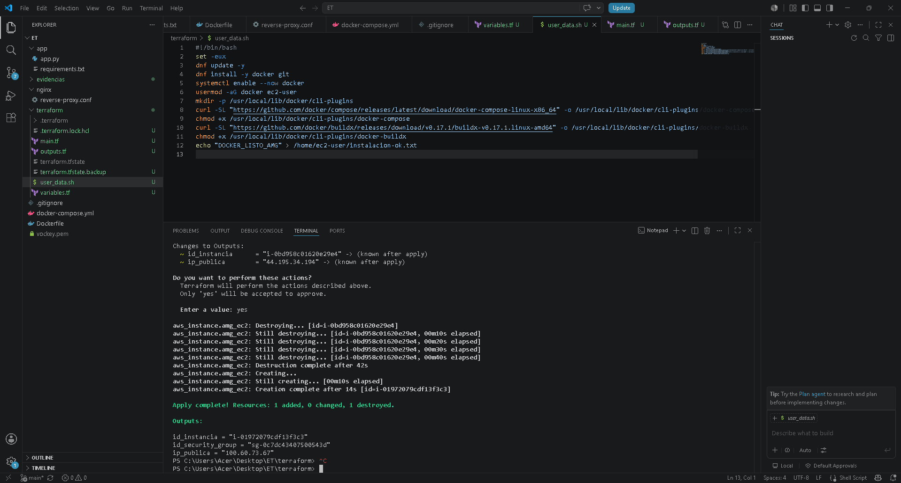

**Docker Engine y Docker Compose instalados en la instancia por el user_data.**

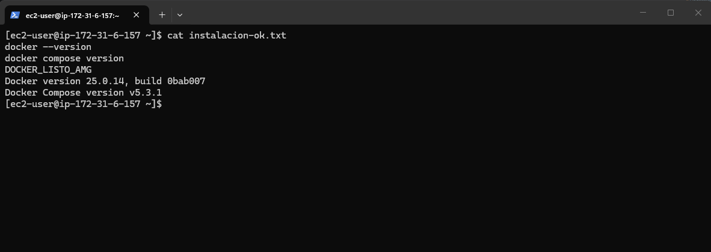

**Stack levantado: docker compose ps con los tres contenedores Up y docker images con la imagen propia.**

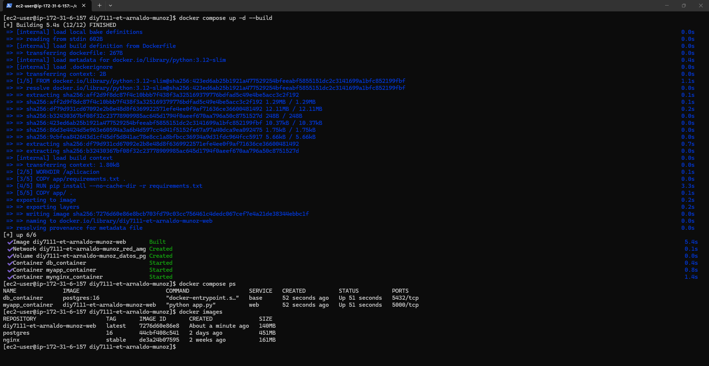

**Aplicacion respondiendo por curl local: el contador de visitas se incrementa.**

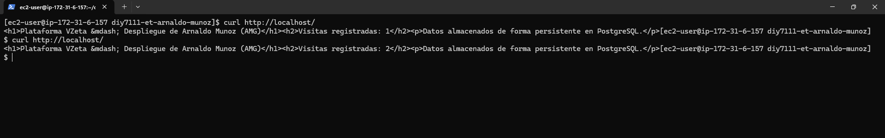

**Acceso como cliente externo desde el equipo, contra la IP publica.**

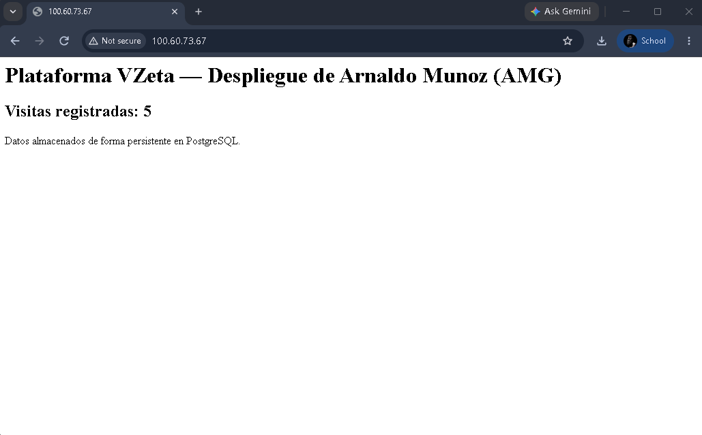

**Persistencia: tras docker compose down y up el contador no se reinicia, gracias al volumen datos_pg.**

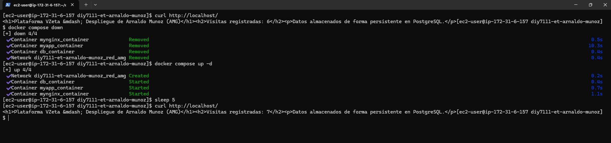

**docker inspect de la seccion Mounts del contenedor de la base de datos.**

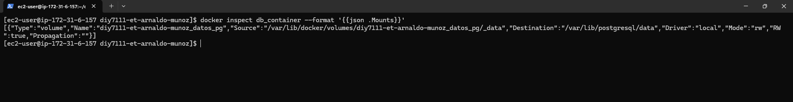

**Inspeccion del volumen y de la red bridge red_amg con los tres contenedores conectados.**

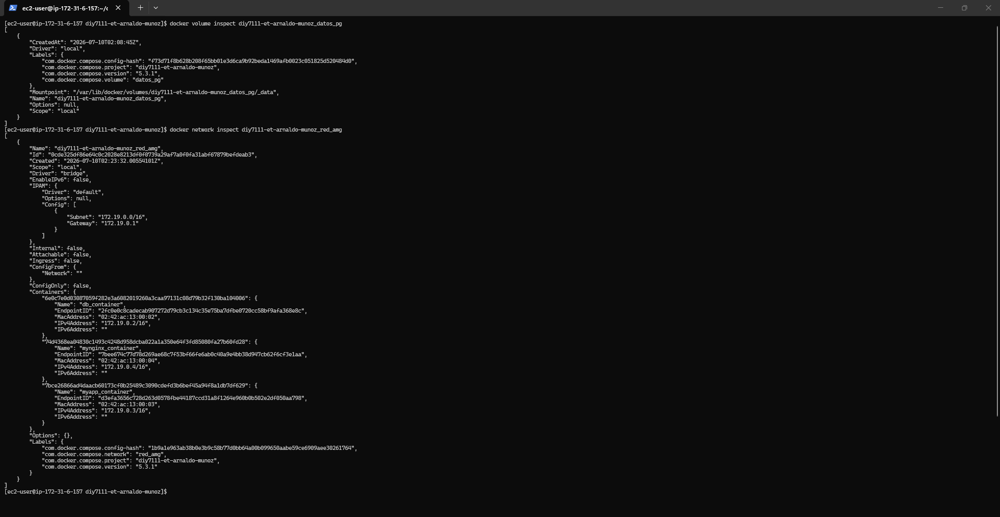

**docker logs de la aplicacion Flask.**

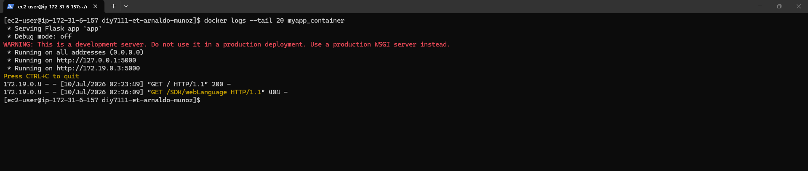

**docker stats con el uso de CPU y memoria.**

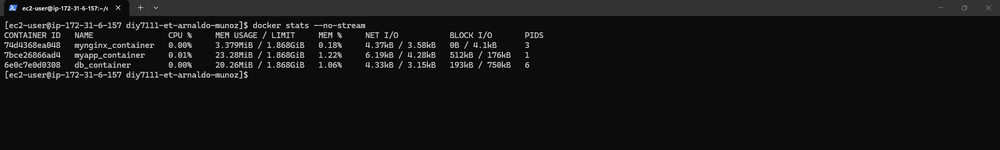

**Reinicio del reverse proxy con docker restart y verificacion.**

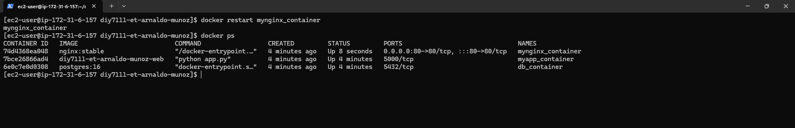

**Ciclo de vida: stop, rename, rm del contenedor y rmi de la imagen.**

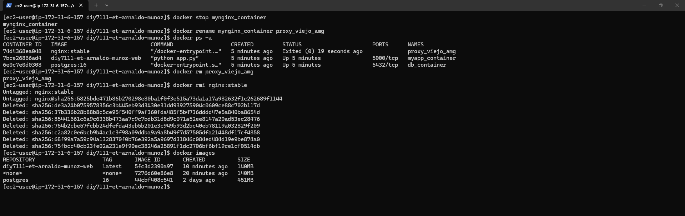

**Restauracion del stack con docker compose up para dejarlo operativo.**

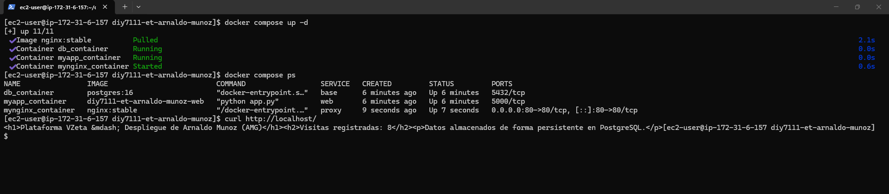